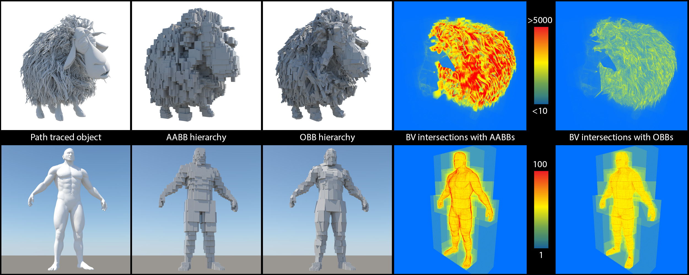

# Parallel Transformation of Bounding Volume Hierarchies into Oriented Bounding Box Trees

This repository contains a reference implementation of the method described in:

> __Parallel Transformation of Bounding Volume Hierarchies into Oriented Bounding Box Trees__  
> N. Vitsas, I. Evangelou, G. Papaioannou, A. Gkaravelis <br />
> _to appear: Eurographics 2023_  <br />
> [ [Paper](http://graphics.cs.aueb.gr/graphics/docs/papers/OBBTreeBuilder.pdf) ]



## Building
The project uses the `cmake` build system.

To configure and generate platform specific build scripts, execute:

`cmake -S src -B build`

**NOTE:** If CUDA is not found automatically from cmake, you will need to manually set the `CUDA_TOOLKIT_ROOT_DIR` variable and reconfigure.

To build the project, execute:

`cmake --build build --config Release`

Binaries will be created in `bin/Release`. 

## Running

The main application is `korangar.exe`. Integrators and intersectors are compiled as separate, dynamically loaded libraries. 

`cd bin\Release`

This release offers two integrators

`pt_gpu` and `bench`

and two intersectors

`lbvh_gpu` and `atrbvh_gpu`

The app exposes a very basic CLI.
```
-s <path/to/scene.gltf>
-intersector lbvh_gpu|atrbvh_gpu
-integrator bench|pt_gpu
-use_obbs
-collapse
```

- `pt_gpu` is a basic preview of the provided scene that uses the selected intersector to render the object using ray tracing.

- `bench` implements a benchmark that calculates the OBB of the point set of the provided scene using the CPU version of DiTO and the GPU-accelerated version of DiTO.

- `lbvh_gpu` is a custom implementation of the GPU-accelerated [LBVH builder](https://diglib.eg.org/bitstream/handle/10.2312/EGGH.HPG12.033-037/033-037.pdf?sequence=1) by Tero Karras .

- `atrbvh_gpu` is an adapted implementation of the GPU-accelerated [ATRBVH builder](https://github.com/leonardo-domingues/atrbvh) by Domingues and Pedrini.


E.g. run:
```
korangar.exe -s ../../rsrc/gltf/hairball/hairball.gltf -integrator pt_gpu -intersector atrbvh_gpu -use_obbs -collapse
```

To preview the `hairball` scene using OBB traversal with ATRBVH and node collapsing.

or

```
korangar.exe -s ../../rsrc/gltf/hairball/hairball.gltf -integrator pt_gpu -intersector lbvh_gpu -use_obbs -collapse
```

to use the LBVH structure.

To execute the benchmark that builds the standalone OBB for a scene, run:

```
korangar.exe -s ../../rsrc/gltf/dragon/dragon.gltf -integrator bench
```

## Implementation

The paper contributes two algorithms:
- A standalone, GPU-accelerated implementation of the DiTO algorithm that calculates a high quality OBB for a point set.

The algorithm is implemented in `src\common\algorithm\dito\dito.cu` with the function `kr_cuda_points_obb`

- A parallel, GPU-accelerated transformation of an existing tree based on AABBs to a tree based on OBBs

The algorithm is implemented in `src\ads\common\cuda\transforms.cu` with the function `kr_cuda_bvh_obb_tree`